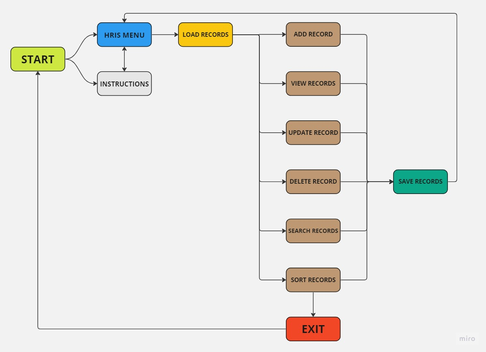
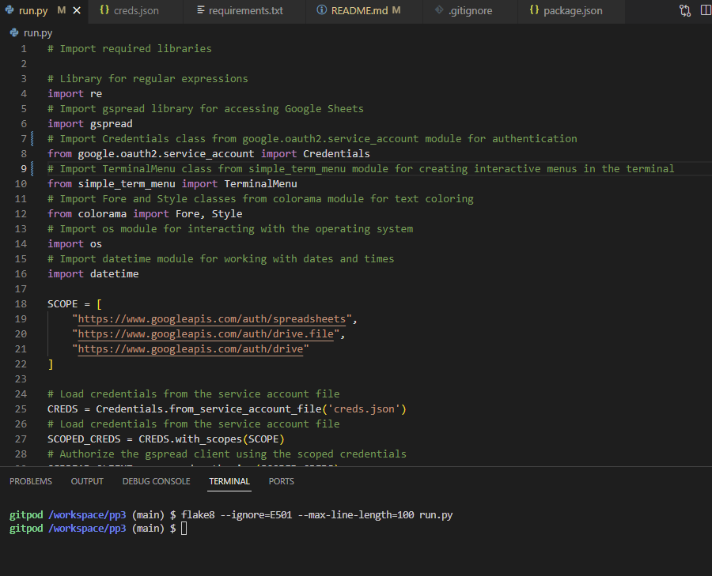

# Human Resources Information System (HRIS)

The Human Resources Information System (HRIS) is an application designed to manage and store employee records efficiently. It provides a user-friendly interface to perform various HR-related tasks, facilitating effective management of employee information.

## User Stories

As a Human Resources Manager, I want to:
- Easily add new employee records to the system, including details such as name, department, position, start date, and salary.
- View a comprehensive list of all employee records in the HRIS system, allowing me to have an overview of the workforce.
- Update employee records when there are changes in their position, salary, or department.
- Remove employee records from the system when an employee leaves the organization.
- Search for specific employee records based on keywords or criteria such as name, department, or position.
- Sort employee records based on various attributes such as name, department, position, or start date.

## Features

- **Add employee records**: Users can easily enter employee details such as name, department, position, start date, and salary and save them in the HRIS system.
- **View employee records**: Users can access a comprehensive list of all employee records stored in the HRIS system, facilitating an overview of the workforce.
- **Update employee records**: Users can modify specific fields of an employee's record, such as position, salary, or department, and save the changes, ensuring accurate and up-to-date employee information.
- **Delete employee records**: Users can remove employee records from the HRIS system, ensuring the privacy and security of employee information when an employee leaves the organization.
- **Search employee records**: Users can search for specific employee records based on keywords or criteria such as name, department, or position, making it easier to find relevant information quickly.
- **Sort employee records**: Users can sort the employee records based on various attributes such as name, department, position, or start date, in ascending or descending order, providing flexibility in data analysis and reporting.

## User Experience

The HRIS application aims to provide a seamless and intuitive user experience, ensuring that HR tasks can be performed efficiently. Some key aspects of the user experience include:

- **Clean and intuitive interface**: The application features a user-friendly command-line interface (CLI) with clear menu options and instructions, making it easy for users to navigate and interact with the system.
- **Validation and error handling**: The application incorporates input validation and error handling mechanisms to prevent incorrect data entry and provide meaningful error messages when necessary, enhancing the reliability of the system.
- **Color-coded output**: The use of colorama library allows for visual enhancements in the terminal output, providing a more engaging and pleasant user experience.
- **Efficient data storage**: The application leverages Google Sheets to store and retrieve employee records, ensuring data integrity and accessibility from anywhere with an internet connection.
- **Fast and responsive**: The application is designed to perform tasks quickly and respond promptly to user inputs, ensuring a smooth and efficient experience.

## Technologies Used

The HRIS application is built using the following technologies:

- Python: The core programming language used for developing the application logic.
- gspread: A Python library for accessing and modifying Google Sheets, used for storing and retrieving employee records.
- re: A Python library for working with regular expressions, used for input validation and search functionality.
- colorama: A Python library for terminal output coloring, used to enhance the user interface.
- simple_term_menu: A Python library for creating interactive menus in the terminal, used for user interaction.
- datetime: A Python library for working with dates and times, used for handling the start date of employees.

## Development Process

The development of the HRIS application went through the following stages:

1. **Brainstorming**: The initial phase involved brainstorming the requirements and features of the HRIS application. User stories were identified to define the needs and expectations of the target users, primarily the Human Resources Manager.

2. **Design**: The design phase included creating a flowchart to visualize the flow of the application and the various user interactions. The flowchart helped in understanding the different screens, inputs, and outputs of the application, providing a high-level overview of the system's structure.

The following flowchart represents the flow of the HRIS application, illustrating the different screens and user interactions:

   

3. **Implementation**: The application was developed using Python programming language and various libraries, such as gspread for interacting with Google Sheets API, colorama for terminal output enhancements, and argparse for handling command-line arguments. The code was structured using object-oriented programming principles to ensure modularity and maintainability.

4. **Testing**: The application was tested extensively to ensure proper functionality and to identify and fix any bugs or issues. Test cases were created to cover different scenarios and user interactions, ensuring the application performs as expected in various situations. 

The PEP8 linter is used to check the code for adherence to the PEP8 style guide for Python code. It ensures that the code follows consistent coding standards and enhances readability.

   

5. **Deployment to Heroku**: 

The HRIS application can be easily deployed to the Heroku cloud platform for convenient access and usage. Follow the steps below to deploy the application using Heroku and the GitHub integration:

1. **Create a Heroku app**: Log in to your Heroku account and create a new app. Choose a suitable app name and region for your deployment.

2. **Connect to GitHub**: In the "Deployment" tab of your Heroku app dashboard, connect your Heroku app to your GitHub repository. Select the repository and enable automatic deploys for the `main` branch or any other desired branch.

3. **Set up necessary dependencies**: In the "Settings" tab of your Heroku app dashboard, navigate to the "Config Vars" section. Add the required environment variables, credentials, and any other variables needed for the application.

4. **Deploy the app**: Once connected to the GitHub repository and configured the necessary environment variables, trigger a manual deployment or wait for automatic deployment to occur when changes is pushed to the GitHub repository.

5. **Monitor deployment**: After initiating the deployment, I monitor the build process and check the logs for any errors or issues. The Heroku dashboard provides insights into the deployment status and logs for troubleshooting purposes.

6. **Access the deployed app**: Once the deployment is successful, I accessed the HRIS application by visiting the URL provided by Heroku for the app.

## Acknowledgments

I would like to thank the following people:

Lauren-Nicole & Julia

* My helpful mentors at Code Institute who was always there to offer useful tips and constructive feedback.

### Useful Sources

Websites that have provided me with information and assistance beneficial to this project:

* [W3C Schools](https://www.w3schools.com/)
* [Official Python Documentation](https://docs.python.org/3/)
* [Stack Overflow](https://stackoverflow.com/)

The top screenshot in this ReadMe was created with:

* [Am I Responsive](https://ui.dev/amiresponsive)

Best regards,

[HRIS](!!!!)