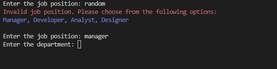
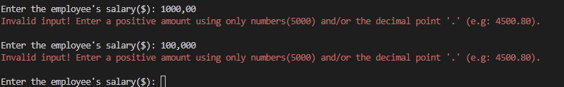

# Human Resources Information System (HRIS)

The Human Resources Information System (HRIS) is an application designed to manage and store employee records efficiently. It provides a user-friendly interface to perform various HR-related tasks, facilitating effective management of employee information.

## User Stories

As a Human Resources Manager, I want to:
- Easily add new employee records to the system, including details such as name, department, position, start date, and salary.
- View a comprehensive list of all employee records in the HRIS system, allowing me to have an overview of the workforce.
- Update employee records when there are changes in their position, salary, or department.
- Remove employee records from the system when an employee leaves the organization.
- Search for specific employee records based on keywords or criteria such as first or last names.
- Sort employee records based on various attributes such as first name, last name, or age.

## Features

- **Add employee records**: Users can easily enter employee details such as name, department, position, start date, and salary and save them in the HRIS system.
- **View employee records**: Users can access a comprehensive list of all employee records stored in the HRIS system, facilitating an overview of the workforce.
- **Update employee records**: Users can modify specific fields of an employee's record, such as position, salary, or department, and save the changes, ensuring accurate and up-to-date employee information.
- **Delete employee records**: Users can remove employee records from the HRIS system, ensuring the privacy and security of employee information when an employee leaves the organization.
- **Search employee records**: Users can search for specific employee records based on keywords or criteria such as first name, or last name, making it easier to find relevant information quickly.
- **Sort employee records**: Users can sort the employee records based on various attributes such as first name, last name, or age, in ascending order, providing flexibility in data analysis and reporting.

## User Experience

The HRIS application aims to provide a seamless and intuitive user experience, ensuring that HR tasks can be performed efficiently. Some key aspects of the user experience include:

- **Clean and intuitive interface**: The application features a user-friendly command-line interface (CLI) with clear menu options and instructions, making it easy for users to navigate and interact with the system.
- **Validation and error handling**: The application incorporates input validation and error handling mechanisms to prevent incorrect data entry and provide meaningful error messages when necessary, enhancing the reliability of the system.
- **Color-coded output**: The use of colorama library allows for visual enhancements in the terminal output, providing a more engaging and pleasant user experience.
- **Efficient data storage**: The application leverages Google Sheets to store and retrieve employee records, ensuring data integrity and accessibility from anywhere with an internet connection.
- **Fast and responsive**: The application is designed to perform tasks quickly and respond promptly to user inputs, ensuring a smooth and efficient experience.

## Technologies Used

The HRIS application is built using the following technologies:

- Python: The core programming language used for developing the application logic.
- gspread: A Python library for accessing and modifying Google Sheets, used for storing and retrieving employee records.
- re: A Python library for working with regular expressions, used for input validation and search functionality.
- colorama: A Python library for terminal output coloring, used to enhance the user interface.
- simple_term_menu: A Python library for creating interactive menus in the terminal, used for user interaction.
- datetime: A Python library for working with dates and times, used for handling the start date of employees.
- time: A Python library for time-related functions, used for various time-related operations within the application.
- os: A Python library for interacting with the operating system, used for clearing the terminal screen and other system-related tasks.
- Credentials: This import of Credentials class from the google.oauth2.service_account module, which is used for authentication  
  purposes when accessing Google Sheets.

## Development Process

The development of the HRIS application went through the following stages:

1. **Brainstorming**: The initial phase involved brainstorming the requirements and features of the HRIS application. User stories were identified to define the needs and expectations of the target users, primarily the Human Resources Manager.

2. **Design**: The design phase included creating a flowchart to visualize the flow of the application and the various user interactions. The flowchart helped in understanding the different screens, inputs, and outputs of the application, providing a high-level overview of the system's structure.

The following flowchart represents the flow of the HRIS application, illustrating the different screens and user interactions:

   

3. **Implementation**: The application was developed using Python programming language and various libraries, such as gspread for interacting with Google Sheets API and colorama for terminal output enhancements. The code was structured using object-oriented programming principles to ensure modularity and maintainability.

4. **Testing**: The application was tested extensively to ensure proper functionality and to identify and fix any bugs or issues. Test cases were created to cover different scenarios and user interactions, ensuring the application performs as expected in various situations. 

The PEP8 linter is used to check the code for adherence to the PEP8 style guide for Python code. It ensures that the code follows consistent coding standards and enhances readability.

During the development of the HRIS application in run.py, I encountered several errors related to the maximum line length specified in the PEP8 style guide. To ensure code readability and adherence to best practices, I made the necessary adjustments to resolve these errors.

By following the PEP8 guidelines, I refactored the code in run.py to ensure that each line does not exceed the recommended maximum line length. This involved breaking down long lines into multiple lines using appropriate line continuation techniques, such as using parentheses, backslashes, or string concatenation.

By resolving these errors, the code in run.py now adheres to the PEP8 standard, promoting consistency and readability. It also ensures that the codebase follows industry best practices and enhances maintainability in the long run.

I understand the importance of adhering to coding conventions and standards, and I strive to ensure that the code I produce meets these requirements. Resolving the max line length errors in run.py allows for better readability and improves the overall quality of the codebase.

   PEP8 Linter Validation of run.py:

   
   
   

   PEP8 Linter Validation of validation_functions.py:

   
   
   PEP8 Linter Validation of print_record.py:

   

   - Manual Testing

I conducted manual testing for the Human Resources Information System (HRIS) application. Below are the tests I performed, including deliberately entering invalid input to check the error handling:

#### Test 1: Add a New Record

1. Launched the HRIS application.
2. From the main menu go to HRIS Menu, selected "Add Record."
3. Entered the required information for the new record, such as the employee's name, position, and department.
4. Validated that the record was successfully added by checking the displayed confirmation message and verifying the updated list of records.
5. Took a screenshot of the application's interface after adding the record.
6. No errors or issues were encountered during this test.

Main Menu:

Instructions to the App:

HRIS Menu:

Add Record -> Add Employee's Name:

During testing, I deliberately entered a single letter as the input for both the first name and last name fields to test the application's input validation. This action was intended to simulate an invalid input scenario.

The HRIS application expects valid first and last names, which typically consist of more than one letter. As part of the input validation process, the application checks the length of the entered values and ensures they meet the minimum requirements.

Upon detecting the single-letter inputs, the application recognized them as invalid and responded by displaying an error message. The error message specifically states that a minimum of two letters is required for both the first name and last name inputs.

Add Record -> Add Employee's Date of Birth:

During testing, I intentionally entered different types of invalid inputs for the date of birth field to assess the application's input validation capabilities. Here are the inputs I used and the corresponding error messages generated by the HRIS application:

1. Input: "t"
Error Message: "Invalid input. Please enter a valid date of birth in the format dd-mm-yyyy."

Explanation: When the input was a single letter "t," the application recognized it as invalid since it does not conform to the expected date format. The error message clearly indicates the required format (dd-mm-yyyy) and prompts the user to provide a valid date of birth.

2. Input: "20-20-2020"
Error Message: "Invalid date. Please enter a valid date of birth."

Explanation: In this case, the input "20-20-2020" represents an invalid date since it does not exist in the calendar (there is no 20th month). The application detected this inconsistency and generated an error message stating that the entered date is invalid. The user is then prompted to provide a valid date of birth.

3. Input: Future date (e.g., "10-07-2025")
Error Message: "Invalid date. Please enter a valid date of birth."

Explanation: When a future date is entered, such as "10-07-2025," the application identifies it as an invalid date since it is beyond the current date. The error message notifies the user that the date of birth must be a valid past date and requests them to input a valid value accordingly.

Add Record -> Add Employee's Address:

During testing, I entered an address input consisting of only three letters to evaluate the address validation implemented in the HRIS application. Here is the input I used and the corresponding error message generated by the application:

Input: "ttt"
Error Message: "Invalid input. The address should contain at least 5 characters."

Explanation: In this case, the application recognizes that the entered address ("ttt") does not meet the minimum length requirement of five characters. The error message clearly states the validation rule, informing the user that the address should contain a minimum of five characters. This requirement ensures that valid and meaningful addresses are entered into the system.

Add Record -> Add Employee's Email:

During testing, I evaluated the email address validation implemented in the HRIS application by entering different inputs. First, I entered the word "random" without the "@" and "." symbols, which triggered an invalid email address error message. Here's the input I used and the corresponding error message generated by the application:

Input: "random"
Error Message: "Invalid input. Please enter a valid email address."

Explanation: The application correctly identified that the entered input ("random") does not meet the required format of an email address. The error message provides clear guidance to the user, indicating that a valid email address is expected. This validation ensures that the email address contains the necessary components, such as the "@" symbol and a domain name, to prevent incomplete or incorrect data.

Next, I entered a valid email address, "random@random.com," which the application accepted without triggering any error message. This demonstrates that the application recognizes and accepts properly formatted email addresses, allowing users to provide accurate and complete information.

Add Record -> Add Employee's Job Position:

During testing, I evaluated the job position validation implemented in the HRIS application. I entered the word "random" as the job position, which triggered an invalid input message. Additionally, the application provided me with a predefined list of valid job positions, including "manager," "developer," "analyst," and "designer." This validation ensures that only the specified job positions are accepted, maintaining consistency and accuracy in recording employee data. By restricting the choices to a predefined list, the HRIS application enhances data integrity and standardization within the system.

Add Record -> Add Employee's Department:

During the testing phase, I conducted a similar evaluation on the department validation feature implemented in the HRIS application. In this test, I inputted the word "random" as the department, which resulted in an invalid input error message. The application displayed a predefined list of valid departments, including "sales," "marketing," "finance," and "hr," prompting the user to select from these options. By enforcing the selection of valid departments from a predefined list, the HRIS application ensures consistency and accuracy in recording employee information. This validation mechanism promotes standardized data entry and enhances data integrity within the system, facilitating efficient department-wise data management.

Add Record -> Add Employee's Salary:

During testing, I evaluated the salary input validation in the HRIS application by entering different inputs. First, I entered an alphabetic input for the salary, which triggered an invalid input error message. Here's the input I used and the corresponding error message generated by the application:

Input: "RANDOM"
Error Message: "Invalid input! Enter a positive amount using only numbers (e.g., 5000) and/or the decimal point '.' (e.g., 4500.80)."

Explanation: The application correctly identified that the entered input ("RANDOM") does not conform to the expected format for the salary. The error message provides clear instructions to the user, specifying that only positive amounts using numbers and/or the decimal point are allowed. It also provides examples to illustrate the correct format. This validation ensures that only valid salary values are accepted, preventing incorrect or inappropriate data entries.

Next, I entered numeric values for the salary but included commas to represent thousands, such as "1000,00" and "100,000". The application considered these inputs as invalid and displayed the appropriate error message. The correct format for the salary input is without commas, such as "100000" for one hundred thousand or with decimal values like "20.50" for twenty dollars and fifty cents. This validation ensures consistency and accuracy in the salary data.

Add Record -> Add Employee's Hire Date:

During testing, I evaluated the hire date validation implemented in the HRIS application. To test the minimum age requirement, I entered a birthdate of "12-12-1990" and attempted to set the hire date as "01-01-2000". The application correctly identified that the employee's age does not meet the minimum requirement for employment, which is 18 years. Here's the input I used and the corresponding error message generated by the application:

Input:
Date of Birth: "12-12-1990"
Hire Date: "01-01-2000"

Error Message: "Invalid date! The employee does not meet the age requirement. The minimum age for employment is 18 years."

Explanation: The application successfully detected that the employee's age, calculated based on the birthdate and hire date, falls below the minimum age requirement of 18 years. This validation ensures compliance with legal regulations and company policies regarding the minimum age for employment. By preventing the hiring of individuals who do not meet the age requirement, the application helps maintain legal compliance and protects the rights and well-being of employees.

Record Saved:

Add Another Record:

Saving Record 2:

Record Saved to Google Sheets:

Record Saved in Google Sheet:

Exit:

#### Test 2: View Records

1. From the main menu, selected "View Records."
2. Verified that the list of records was displayed correctly, including all the relevant information for each record.
3. Took a screenshot of the application's interface showing the list of records.
4. No errors or issues were encountered during this test.

View Record:

#### Test 3: Update a Record

1. From the main menu, selected "Update Record."
2. Entered the Record Number.
3. Updated the necessary fields, such as the employee's position or department.
4. Confirmed that the record was successfully updated by checking the displayed confirmation message and verifying the updated information.
5. Took a screenshot of the application's interface after updating the record.
6. No errors or issues were encountered during this test.

Update Record:

#### Test 4: Delete a Record

1. From the main menu, selected "Delete Record."
2. Entered the Record Number.
3. Confirmed the deletion by following the on-screen instructions.
4. Validated that the record was successfully deleted by checking the displayed confirmation message and verifying the updated list of records.
5. Took a screenshot of the application's interface after deleting the record.
6. No errors or issues were encountered during this test.

Delete Record:

Delete Record Confirmation:

Delete Record Cancellation:

The user will be prompted with a confirmation message after providing the record number: 'Are you sure you want to delete this record? (y/n):' If the user enters 'n', the deletion process will be cancelled, and the user will be redirected back to the HRIS Menu. However, if the user enters 'y', the record associated with the employee will be permanently deleted and removed from the Google sheet.

Deleted Record Updated to Google Sheet:

View Record after Deletion:

#### Test 5: Search Records

1. From the main menu, selected "Search Records."
2. Entered the search criteria, such as the employee's first name or last name.
3. Verified that the search results displayed the relevant records matching the search criteria.
4. Took a screenshot of the application's interface showing the search results.
5. No errors or issues were encountered during this test.

Search Record:

Searched Record Result:

#### Test 6: Sort Records

1. From the main menu, selected "Sort Records."
2. Chose the sorting option, such as sorting by employee's first name, last name or age.
3. Verified that the records were sorted in the selected order.
4. Took a screenshot of the application's interface showing the sorted records.
5. No errors or issues were encountered during this test.

Sort Record:

Sorted Record:

#### Test 7: Invalid Input Handling

1. Throughout the testing process, intentionally entered invalid input in various scenarios, such as entering incorrect data types or exceeding input length limits.
2. Verified that the HRIS application displayed appropriate error messages or alerts to notify about the invalid input.
3. Took screenshots of the application's interface showing the error messages or alerts for each invalid input scenario.
4. No unexpected errors or issues were encountered during this test, and the application handled invalid input as expected.

Based on the manual testing conducted, all the functionalities of the HRIS application worked as expected without any errors or issues. The application performed well, provided the intended results, and effectively handled invalid input scenarios.

### Bugs

During the development of this project, I encountered a bug related to the usage of the `git add .` command. Throughout the development process, I relied on the `git add .` command to stage my changes. However, this command adds all changes in the current directory and its subdirectories to the staging area, which caused some unintended files to be included in my commits.

As a result, there were instances where I made commits that included changes to files that were not intended to be part of that particular commit. This led to incorrect commits and caused confusion during the project's history.

I would like to express my gratitude to my mentor who pointed out this bug and helped me understand the issue. Although I cannot make corrections to the previous commits, I have learned from this experience and will be more cautious in future projects. I will make sure to selectively add only the specific files I intend to include in each commit to avoid similar issues.

I apologize for any inconvenience or confusion caused by this bug and appreciate your understanding.

## **Deployment on Heroku**: 

The HRIS application can be easily deployed to the Heroku cloud platform for convenient access and usage. Follow the steps below to deploy the application using Heroku and the GitHub integration:

1. **Create a Heroku app**: Log in to your Heroku account and create a new app. Choose a suitable app name and region for your deployment.

2. **Set up necessary dependencies**: In the "Settings" tab of your Heroku app dashboard, navigate to the "Config Vars" section. Add the required environment variables, credentials, and any other variables needed for the application.

3. **Connect to GitHub**: In the "Deployment" tab of your Heroku app dashboard, connect your Heroku app to your GitHub repository. Select the repository and enable automatic deploys for the `main` branch or any other desired branch.

4. **Deploy the app**: Once connected to the GitHub repository and configured the necessary environment variables, trigger a manual deployment or wait for automatic deployment to occur when changes is pushed to the GitHub repository.

5. **Monitor deployment**: After initiating the deployment, I monitor the build process and check the logs for any errors or issues. The Heroku dashboard provides insights into the deployment status and logs for troubleshooting purposes.

6. **Access the deployed app**: Once the deployment is successful, I accessed the HRIS application by visiting the URL [HRIS on Heroku](https://pp3-hris-6d1cb6f43d2a.herokuapp.com/) provided by Heroku for the app.

## Acknowledgments

I would like to thank the following people:

Lauren-Nicole & Julia

* My helpful mentors at Code Institute who were always there to offer useful tips and constructive feedback.

### Useful Sources

Websites that have provided me with information and assistance beneficial to this project:

* [W3C Schools](https://www.w3schools.com/)
* [Official Python Documentation](https://docs.python.org/3/)
* [Stack Overflow](https://stackoverflow.com/)
* [MIRO](https://miro.com/)

The top screenshot in this ReadMe was created with:

* [Am I Responsive](https://ui.dev/amiresponsive)

Best regards,

[HRIS](https://pp3-hris-6d1cb6f43d2a.herokuapp.com/)