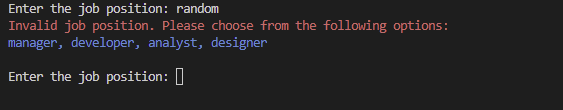
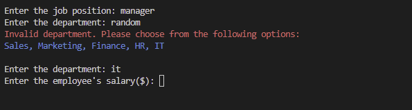
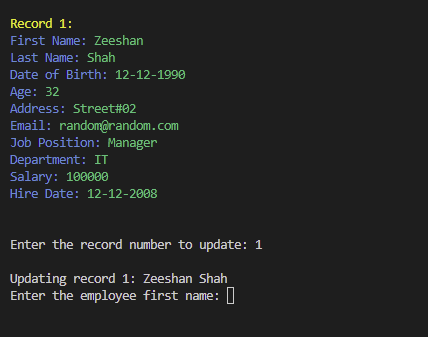

# Human Resources Information System (HRIS)

The Human Resources Information System (HRIS) is an application designed to manage and store employee records efficiently. It provides a user-friendly interface to perform various HR-related tasks, facilitating effective management of employee information.

## User Stories

As a Human Resources Manager, I want to:
- Easily add new employee records to the system, including details such as name, department, position, start date, and salary.
- View a comprehensive list of all employee records in the HRIS system, allowing me to have an overview of the workforce.
- Update employee records when there are changes in their position, salary, or department.
- Remove employee records from the system when an employee leaves the organization.
- Search for specific employee records based on keywords or criteria such as name, department, or position.
- Sort employee records based on various attributes such as name, department, position, or start date.

## Features

- **Add employee records**: Users can easily enter employee details such as name, department, position, start date, and salary and save them in the HRIS system.
- **View employee records**: Users can access a comprehensive list of all employee records stored in the HRIS system, facilitating an overview of the workforce.
- **Update employee records**: Users can modify specific fields of an employee's record, such as position, salary, or department, and save the changes, ensuring accurate and up-to-date employee information.
- **Delete employee records**: Users can remove employee records from the HRIS system, ensuring the privacy and security of employee information when an employee leaves the organization.
- **Search employee records**: Users can search for specific employee records based on keywords or criteria such as name, department, or position, making it easier to find relevant information quickly.
- **Sort employee records**: Users can sort the employee records based on various attributes such as name, department, position, or start date, in ascending or descending order, providing flexibility in data analysis and reporting.

## User Experience

The HRIS application aims to provide a seamless and intuitive user experience, ensuring that HR tasks can be performed efficiently. Some key aspects of the user experience include:

- **Clean and intuitive interface**: The application features a user-friendly command-line interface (CLI) with clear menu options and instructions, making it easy for users to navigate and interact with the system.
- **Validation and error handling**: The application incorporates input validation and error handling mechanisms to prevent incorrect data entry and provide meaningful error messages when necessary, enhancing the reliability of the system.
- **Color-coded output**: The use of colorama library allows for visual enhancements in the terminal output, providing a more engaging and pleasant user experience.
- **Efficient data storage**: The application leverages Google Sheets to store and retrieve employee records, ensuring data integrity and accessibility from anywhere with an internet connection.
- **Fast and responsive**: The application is designed to perform tasks quickly and respond promptly to user inputs, ensuring a smooth and efficient experience.

## Technologies Used

The HRIS application is built using the following technologies:

- Python: The core programming language used for developing the application logic.
- gspread: A Python library for accessing and modifying Google Sheets, used for storing and retrieving employee records.
- re: A Python library for working with regular expressions, used for input validation and search functionality.
- colorama: A Python library for terminal output coloring, used to enhance the user interface.
- simple_term_menu: A Python library for creating interactive menus in the terminal, used for user interaction.
- datetime: A Python library for working with dates and times, used for handling the start date of employees.

## Development Process

The development of the HRIS application went through the following stages:

1. **Brainstorming**: The initial phase involved brainstorming the requirements and features of the HRIS application. User stories were identified to define the needs and expectations of the target users, primarily the Human Resources Manager.

2. **Design**: The design phase included creating a flowchart to visualize the flow of the application and the various user interactions. The flowchart helped in understanding the different screens, inputs, and outputs of the application, providing a high-level overview of the system's structure.

The following flowchart represents the flow of the HRIS application, illustrating the different screens and user interactions:

   

3. **Implementation**: The application was developed using Python programming language and various libraries, such as gspread for interacting with Google Sheets API, colorama for terminal output enhancements, and argparse for handling command-line arguments. The code was structured using object-oriented programming principles to ensure modularity and maintainability.

4. **Testing**: The application was tested extensively to ensure proper functionality and to identify and fix any bugs or issues. Test cases were created to cover different scenarios and user interactions, ensuring the application performs as expected in various situations. 

The PEP8 linter is used to check the code for adherence to the PEP8 style guide for Python code. It ensures that the code follows consistent coding standards and enhances readability.

   
   
   

   
   
   

   - Manual Testing

I conducted manual testing for the Human Resources Information System (HRIS) application. Below are the tests I performed, including deliberately entering invalid input to check the error handling:

#### Test 1: Add a New Record

1. Launched the HRIS application.
2. From the main menu go to HRIS Menu, selected "Add Record."
3. Entered the required information for the new record, such as the employee's name, position, and department.
4. Validated that the record was successfully added by checking the displayed confirmation message and verifying the updated list of records.
5. Took a screenshot of the application's interface after adding the record.
6. No errors or issues were encountered during this test.

Main Menu:

Instructions to the App:

HRIS Menu:

Add Record -> Add Employee's Name:

Add Record -> Add Employee's Date of Birth:

Add Record -> Add Employee's Address:

Add Record -> Add Employee's Email:

Add Record -> Add Employee's Job Position:

Add Record -> Add Employee's Department:

Add Record -> Add Employee's Salary:

Add Record -> Add Employee's Hire Date:

Record Saved:

Add Another Record:

Saving Record 2:

Record Saved to Google Sheets:

Record Saved in Google Sheet:

Exit:

#### Test 2: View Records

1. From the main menu, selected "View Records."
2. Verified that the list of records was displayed correctly, including all the relevant information for each record.
3. Took a screenshot of the application's interface showing the list of records.
4. No errors or issues were encountered during this test.

View Record:

#### Test 3: Update a Record

1. From the main menu, selected "Update Record."
2. Entered the employee ID or selected the record to update.
3. Updated the necessary fields, such as the employee's position or department.
4. Confirmed that the record was successfully updated by checking the displayed confirmation message and verifying the updated information.
5. Took a screenshot of the application's interface after updating the record.
6. No errors or issues were encountered during this test.

Update Record:

#### Test 4: Delete a Record

1. From the main menu, selected "Delete Record."
2. Entered the employee ID or selected the record to delete.
3. Confirmed the deletion by following the on-screen instructions.
4. Validated that the record was successfully deleted by checking the displayed confirmation message and verifying the updated list of records.
5. Took a screenshot of the application's interface after deleting the record.
6. No errors or issues were encountered during this test.

Delete Record:

Delete Record Confirmation:

Delete Record Cancellation:

Deleted Record Updated to Google Sheet:

View Record after Deletion:

#### Test 5: Search Records

1. From the main menu, selected "Search Records."
2. Entered the search criteria, such as the employee's name or department.
3. Verified that the search results displayed the relevant records matching the search criteria.
4. Took a screenshot of the application's interface showing the search results.
5. No errors or issues were encountered during this test.

Search Record:

Searched Record Result:

#### Test 6: Sort Records

1. From the main menu, selected "Sort Records."
2. Chose the sorting option, such as sorting by employee name or department.
3. Verified that the records were sorted in the selected order.
4. Took a screenshot of the application's interface showing the sorted records.
5. No errors or issues were encountered during this test.

Sort Record:

Sorted Record:

#### Test 7: Invalid Input Handling

1. Throughout the testing process, intentionally entered invalid input in various scenarios, such as entering incorrect data types or exceeding input length limits.
2. Verified that the HRIS application displayed appropriate error messages or alerts to notify about the invalid input.
3. Took screenshots of the application's interface showing the error messages or alerts for each invalid input scenario.
4. No unexpected errors or issues were encountered during this test, and the application handled invalid input as expected.

Based on the manual testing conducted, all the functionalities of the HRIS application worked as expected without any errors or issues. The application performed well, provided the intended results, and effectively handled invalid input scenarios.

### Bugs

During the development of this project, I encountered a bug related to the usage of the `git add .` command. Throughout the development process, I relied on the `git add .` command to stage my changes. However, this command adds all changes in the current directory and its subdirectories to the staging area, which caused some unintended files to be included in my commits.

As a result, there were instances where I made commits that included changes to files that were not intended to be part of that particular commit. This led to incorrect commits and caused confusion during the project's history.

I would like to express my gratitude to my mentor who pointed out this bug and helped me understand the issue. Although I cannot make corrections to the previous commits, I have learned from this experience and will be more cautious in future projects. I will make sure to selectively add only the specific files I intend to include in each commit to avoid similar issues.

I apologize for any inconvenience or confusion caused by this bug and appreciate your understanding.

5. **Deployment to Heroku**: 

The HRIS application can be easily deployed to the Heroku cloud platform for convenient access and usage. Follow the steps below to deploy the application using Heroku and the GitHub integration:

1. **Create a Heroku app**: Log in to your Heroku account and create a new app. Choose a suitable app name and region for your deployment.

2. **Connect to GitHub**: In the "Deployment" tab of your Heroku app dashboard, connect your Heroku app to your GitHub repository. Select the repository and enable automatic deploys for the `main` branch or any other desired branch.

3. **Set up necessary dependencies**: In the "Settings" tab of your Heroku app dashboard, navigate to the "Config Vars" section. Add the required environment variables, credentials, and any other variables needed for the application.

4. **Deploy the app**: Once connected to the GitHub repository and configured the necessary environment variables, trigger a manual deployment or wait for automatic deployment to occur when changes is pushed to the GitHub repository.

5. **Monitor deployment**: After initiating the deployment, I monitor the build process and check the logs for any errors or issues. The Heroku dashboard provides insights into the deployment status and logs for troubleshooting purposes.

6. **Access the deployed app**: Once the deployment is successful, I accessed the HRIS application by visiting the URL provided by Heroku for the app.

## Acknowledgments

I would like to thank the following people:

Lauren-Nicole & Julia

* My helpful mentors at Code Institute who was always there to offer useful tips and constructive feedback.

### Useful Sources

Websites that have provided me with information and assistance beneficial to this project:

* [W3C Schools](https://www.w3schools.com/)
* [Official Python Documentation](https://docs.python.org/3/)
* [Stack Overflow](https://stackoverflow.com/)

The top screenshot in this ReadMe was created with:

* [Am I Responsive](https://ui.dev/amiresponsive)

Best regards,

[HRIS](https://pp3-hris-6d1cb6f43d2a.herokuapp.com/)